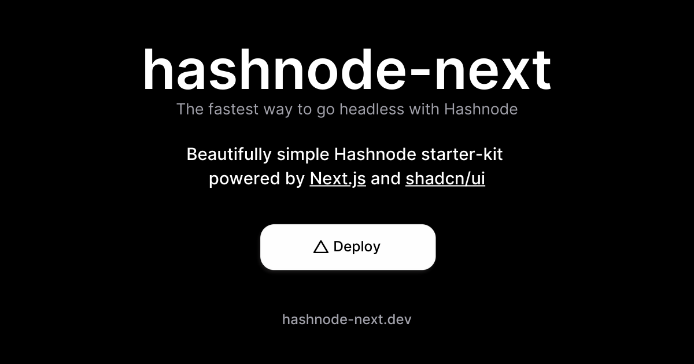

<div align="center">
    <a href="https://vercel.com/new/clone?repository-url=https%3A%2F%2Fgithub.com%2Falexkates%2Fhashnode-next&env=HASHNODE_HOST&envLink=https%3A%2F%2Fapidocs.hashnode.com&project-name=blog&repository-name=blog&demo-title=hashnode-next&demo-description=The%20fastest%20way%20to%20go%20headless%20with%20Hashnode&demo-url=https%3A%2F%2Fhashnode-next.dev%2Fblog&demo-image=https%3A%2F%2Fhashnode-next.dev%2Fdemo.png">
      
    </a>
    <br />
    <a href="https://hashnode-next.vercel.app">View Demo</a>
    ·
    <a href="https://github.com/alexkates/hashnode-next/issues">Report Bug</a>
    ·
    <a href="https://github.com/alexkates/hashnode-next/issues">Request Feature</a>
  </p>
</div>

## Getting Started

```console
npx create-next-app -e https://github.com/alexkates/hashnode-next
```

## Environment Variables

[.env.example](.env.example) contains all the environment variables you need to run a copy of hashnode-next for your headless blog. You can simply copy this file and rename it to `.env.local` to get started.

**Note:** You will need a [Hashnode API key](https://hashnode.com/settings/developer) to view the [about](src/app/about/page.tsx) page because the [GetMe](src/server/get-me.ts) query requires authentication. You can read more about Hashnode API keys [here](https://apidocs.hashnode.com/#introduction-item-4).

## Contributing

Please read through our [contributing guide](.github/CONTRIBUTING.md) before starting any work.

1. Fork the Project
2. Create your Feature Branch (`git checkout -b feature/my-amazing-feature`)
3. Commit your Changes (`git commit -am 'Add some my-amazing-feature'`)
4. Push to the Branch (`git push origin feature/my-amazing-feature`)
5. Open a Pull Request

## Authors

<a href="https://github.com/alexkates/hashnode-next/graphs/contributors">
  
</a>

## Stats


## License

Distributed under the MIT License. See the [license](LICENSE.md) for more information.
